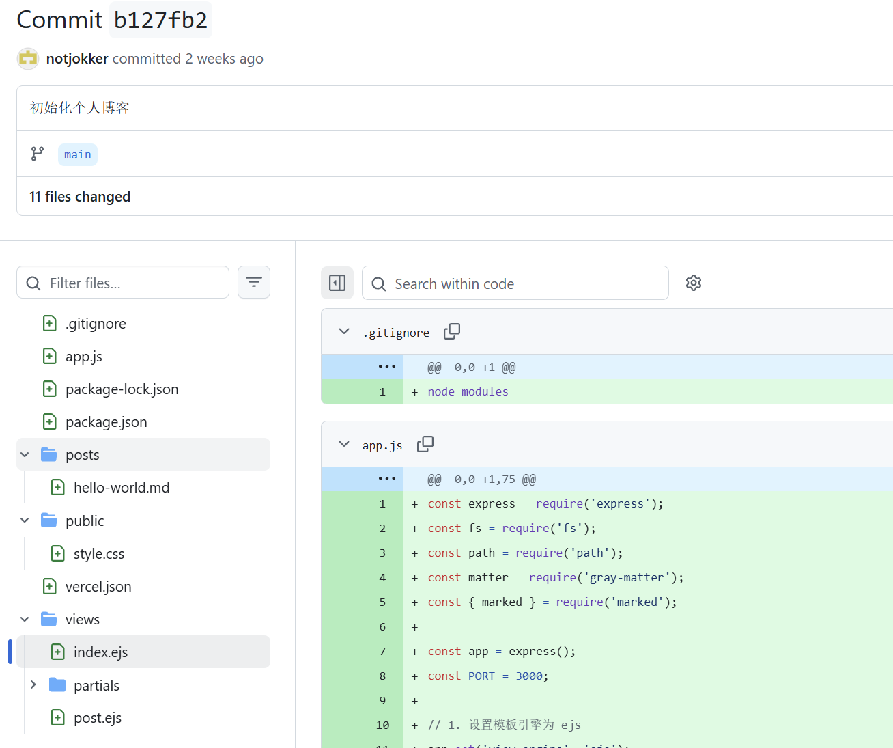
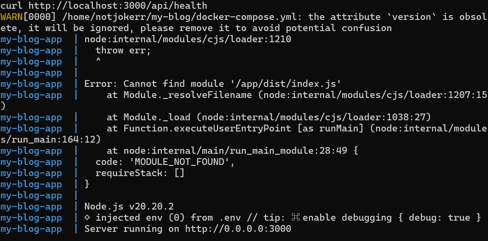
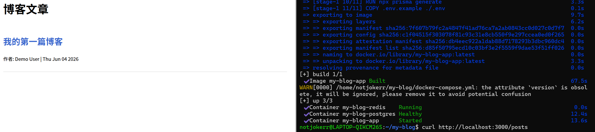
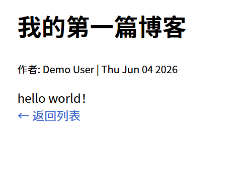

# 一些构建过程的记录和心得体会

我在写课内的大作业时时常要附赠一份精美的实验报告，所以我在搭建博客的时候不免想，我应该写一点东西，来记录我一次次尝试的过程。验收中展现给mentor的多半是能运行的成品，但是怎么从0到一个可以验收的项目，这期间或许也有许多事情值得记录。由于很多话都是有感而发，所以语句逻辑什么的可能不是很顺畅，望visiters见谅。
## week 0：搭建小小模型

最开始我以为博客只是一个小小的能够展现自己的一些成果的平台，所以我只用了最简单最基本的框架进行尝试，大概长这样，就是一个简单的Node.js + Express + EJS + Markdown，然后用Vercel部署。

## week 1：重新建立架构

当我收听了5.30号晚上的验收流程介绍时，我才意识到我之前的想法有多粗浅。
首先要重新设计架构，有了整体的大方向之后才能将一个个代码落到实处。
然后是重新适应新的环境。在配docker的时候尤其愤怒，不知道为什么阿里云的镜像网站用不了（（（（
最后借助科学上网之力才得以代理。

然后我使用了prisma做了一个简单的数据库，用ejs做了简单的页面设计。最困扰我的地方都是在docker容器中总是会因为等原因导致报错，debug过了很久。不过后来还是成功了。

