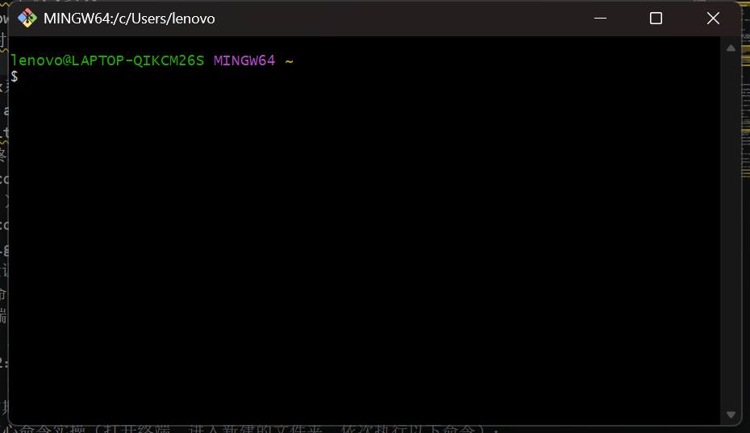

# 第一周（4月27日）Git学习与实践步骤笔记
## 1：Git安装 + 环境配置
1. Git下载与安装
Windows系统：访问Git官方网站（https://git-scm.com/download/win），下载对应版本，安装时一路默认下一步即可，安装完成后打开Git Bash（终端）；

Linux系统：打开终端，直接执行以下命令，自动完成安装：
sudo apt update && sudo apt install git -y
我用的是wsl，所以直接安装即可。

2.Git身份配置
打开终端，依次执行以下两条命令，替换引号内内容：
git config --global user.name "名字/昵称" （例：git config --global notjokker ）
git config --global user.email "你的邮箱" （建议与GitHub注册邮箱一致，例：git config --global user.email "xxx@163.com"）
验证配置是否成功git config --list

## 2：Git基础核心命令
（1）初始化Git仓库（让该文件夹被Git管理）：git init
（2）新建测试文件：在文件夹内新建readme.txt文件
（3）将文件加入暂存区（告诉Git，需要记录该文件的修改）：
git add readme.txt （单个文件暂存）
或 git add . （一次性暂存文件夹内所有修改的文件，推荐使用）
（4）提交版本（将暂存区的修改永久记录到仓库，提交信息需清晰，说明本次修改内容）：
git commit -m "第一次提交：创建readme.txt文件，记录Git学习笔记"
（5）查看提交历史（查看本次提交的记录，确认提交成功）：git log

## 3：分支管理
（1）查看当前所有分支（默认只有一个main/master主分支）：git branch
（2）创建新分支（命名为dev，用于后续开发练习，与主分支隔离）：git branch dev
（3）切换到dev分支（后续操作均在dev分支上进行，不影响主分支）：git checkout dev
或 git switch dev 
（4）在dev分支上修改文件、提交版本：
i.打开readme.txt文件，新增内容（例：“在dev分支上新增Git分支学习笔记”）；
ii.暂存并提交修改：
git add .
git commit -m "dev分支：新增分支学习相关内容"
（5）切回主分支（main）：
git checkout main 或 git switch main
（6）将dev分支的修改合并到主分支（将开发好的内容同步到主分支）：
git merge dev

## 4：远程仓库（GitHub）关联
1. GitHub账号注册与远程仓库创建：
git remote add origin https://github.com/notjokker/my-blog.git
查看关联是否成功：
git remote -v
若显示origin对应的远程仓库地址，即为关联成功。
推送本地代码到远程仓库：
（1）第一次推送（需指定主分支，绑定本地与远程主分支）：
git push -u origin main
推送时可能需要输入GitHub账号和密码（或令牌），按提示操作即可；
（2）后续推送（无需指定分支，直接推送）：
git push
拉取远程仓库更新（备用，后续换电脑或团队协作时使用）：
git pull origin main

## 5.高频辅助命令：
版本回退：git reset --hard 版本号
简单合并冲突解决（新手常见场景）：
重新执行git 查看当前文件状态（哪些文件被修改、哪些未暂存）：git status
查看文件具体修改内容（修改了哪些行）：git diff

## 6.思考题
1.大家可以看到，我们在文中将 Git 与 GitHub/GitLab 并列介绍。版本控制系统与代码托管平台分别解决什么问题？为什么会用 Git 不等于会协作开发？
```
版本控制系统（如 Git） 解决的是个体或团队对文件变更历史的记录、追溯与管理问题，记录每次修改的内容、作者、时间，并支持分支开发、版本回退、差异对比等操作，核心在的版本管理。
代码托管平台（如 GitHub/GitLab） 解决的是代码的远程存储、多成员共享、协作流程管控与持续集成/部署问题。

会用 Git 基本命令（add、commit、push）只代表能独立管理自己的版本。真正的协作开发需要额外掌握分支策略与工作流、代码审查、冲突解决、规范化提交，沟通共识等技能。
```
2.如何管理本地git？
```
1.仓库初始化与配置 git init
2.日常版本流转 git add/commit/status/log
3.分支管理 git branch/switch/checkout/merge
4.撤销与回退 git restore/reset
5.标签管理 git tag
6.忽略文件 在项目根目录创建 .gitignore，写入无需版本控制的文件或目录
7.临时保存现场 git stash
```
3.什么是小驼峰命名？什么是snake_case命名？
```
小驼峰命名（camelCase）:第一个单词全小写，其后每个单词的首字母大写，单词间无分隔符.
snake_case:所有字母小写，单词间用下划线 _ 连接。
```

# 第二周（5月3日）Vibe Coding与Agent学习笔记
## 1. Vibe Coding 总览
Vibe Coding 是以自然语言意图为入口、以大语言模型为生成引擎、以工程工具链为执行环境、以自动化验证为质量闭环的软件开发范式。Agent 则在此基础上引入目标管理、状态维护、工具调用和反馈循环。

**核心技术脉络**：
LLM 生成能力 → Function Calling / Tool Use → Agent Loop → MCP / Skill / Workflow → RAG / Memory / SubAgent / Agent Team → 可验证、可追踪的 AI Native 工程系统

**人与模型的分工**：
- 人：定义目标与验收标准，审查风险与取舍。
- 模型：生成代码、解释错误、补全文档。
- 工具：读写文件、执行命令、运行测试。
- Agent：在目标、工具和反馈间组织多步骤执行。

高质量 Vibe Coding 的关键是建立确定性的工程约束：需求结构化、上下文可控、工具权限清晰、测试自动化。

## 2. 大模型原理与幻觉应对
LLM 基于 token 序列建模，通过上下文计算概率分布生成代码。代码生成能力源于语法模式学习、语义关联压缩、上下文对齐和指令跟随。

**幻觉原因**：参数记忆非事实查询、上下文缺失、流畅性优先、工具反馈不足、长链路误差累积。  
**工程策略**：模型输出应视为候选实现，遵循“生成 → 静态检查 → 单元测试 → 集成测试 → 人工 Review”闭环。  
**多模型协同**：代码生成模型、审查模型、文档模型、研究模型各司其职，降低自证风险。

## 3. 开发工具矩阵与选择
AI 编程工具链按工程化程度分类：

| 形态 | 典型工具 | 适用场景 | 风险 |
|------|----------|----------|------|
| Web Chat | ChatGPT, Claude | 学习、设计草稿 | 版本幻觉 |
| IDE 插件 | Cursor, Copilot | 日常补全 | 局部最优 |
| CLI Agent | Codex CLI | 工程闭环 | 权限过大 |
| 自动化平台 | Dify, Coze | 快速原型 | 调试困难 |
| 框架层 | LangChain, CrewAI | Agent 应用 | 抽象成本 |

选择原则：小范围用 IDE 插件，跨文件修改用 CLI Agent，复杂状态机引入框架。

## 4. MCP 与 Skill
**MCP**：Model Context Protocol，标准化模型与外部工具、数据源的连接。三大原语：Tool（可执行动作）、Resource（可读资源）、Prompt（复用模板）。  
**Skill**：固化高频任务的方法封装，包含触发条件、操作步骤、输出格式和领域知识。  
**关系**：MCP 解决“能调用什么”，Skill 解决“应该怎样做”。
高质量意图必须覆盖：背景、目标、输入输出、关联模块、约束、验收标准。  
**迭代循环**：描述 → 生成最小 diff → 运行（格式化/测试/构建） → 反馈真实日志 → 基于证据修复 → 固化为 Hook 或 CI 脚本。

## 5. 名词速查

| 名词 | 核心定义 | 在 Vibe Coding 中的角色 |
|------|----------|--------------------------|
| LLM | token 预测生成引擎 | 代码生成、方案草拟 |
| Function Calling | 模型输出函数名和参数 | 意图转化为工具调用 |
| Agent | 目标驱动的任务执行系统 | 串联多步骤流程 |
| MCP | 模型连接外部工具的协议 | 统一能力接入层 |
| Skill | 固化操作方法的封装 | 高频任务操作手册 |
| RAG | 检索增强生成 | 基于证据的上下文注入 |

# 第三周（5月10日）计网基础知识、互联网基本认识、Web渲染原理学习笔记
## 1. 协议栈分层模型
网络采用 TCP/IP 四层模型，数据从应用层向下层层封装，接收端反解。

| 层级 | 职责 | 核心协议 | 数据单元 |
|------|------|----------|----------|
| 应用层 | 应用语义与数据格式 | HTTP, DNS, TLS | 消息 |
| 传输层 | 端到端可靠传输、流控 | TCP, UDP | 段 |
| 网络层 | 寻址、路由、分片 | IP, ICMP | 包 |
| 链路层 | 相邻节点帧传输 | Ethernet, Wi-Fi | 帧 |

分层的优势在于每层只关心自己的职责，便于独立演进和故障隔离。

## 2. 传输层：TCP 与 UDP
**TCP**：面向连接、字节流、可靠交付。通过三次握手建立连接，滑动窗口进行流量控制，慢启动/拥塞避免处理网络拥塞。关键状态包括 LISTEN, SYN-SENT, ESTABLISHED 等。  
**UDP**：无连接、数据报、尽力交付。头部开销仅 8 字节，适合实时音视频、DNS 等场景。

对比：

| 特性 | TCP | UDP |
|------|-----|-----|
| 连接 | 面向连接 | 无连接 |
| 可靠性 | 保证顺序和交付 | 不保证 |
| 适用场景 | Web, 文件传输 | 直播, DNS 查询 |

## 3. 网络层与 DNS
**IP 协议**提供尽力而为的寻址和路由。  
**DNS** 将域名解析为 IP 地址，通过递归/迭代查询和缓存机制加速访问。

## 4. HTTP 协议演进
HTTP 建立在 TCP 之上（HTTP/3 基于 QUIC/UDP），是 Web 的通用语言。  
核心要素：请求方法（GET/POST/PUT/DELETE）、状态码（2xx/3xx/4xx/5xx）、消息头部。

| 版本 | 关键改进 | 传输层 |
|------|----------|--------|
| HTTP/1.1 | 持久连接、管道化 | TCP |
| HTTP/2 | 多路复用、头部压缩 | TCP |
| HTTP/3 | 0-RTT 建连，基于 QUIC | UDP |

**HTTPS** = HTTP + TLS，提供加密、身份验证和完整性。

## 5. Web 渲染原理
浏览器加载完整流程：
1. DNS 解析域名 → IP
2. TCP 三次握手（HTTPS 还需 TLS 握手）
3. 发送 HTTP GET 请求，获取 HTML
4. 解析 HTML 构建 DOM，遇到 CSS/JS/图片等资源发起子请求
5. 构建 CSSOM，合并成渲染树，执行布局和绘制


# 第四周（5月17日）前端(React)学习与实践学习笔记

## 1. HTML：结构化文档
HTML 定义页面的**语义结构**，影响可访问性、SEO 和可维护性。
- 语义元素：`<header>`, `<nav>`, `<main>`, `<article>`, `<section>`, `<footer>` 等。
- 表单：`<form>` 配合 `<input>`, `<select>` 等，内置验证 API（`required`, `pattern`）。
- 可访问性：`aria-*`、`role`、`alt` 提供辅助技术信息。

服务端渲染（SSR）与单页应用（SPA）的选择影响首屏速度和 SEO。

## 2. CSS：布局与设计系统
核心概念：盒模型（content → padding → border → margin），`box-sizing: border-box` 为工程标准。
- **Flexbox**：一维布局，擅长对齐和分布，适合导航栏、卡片。
- **Grid**：二维布局，控制行和列，适合页面框架。

| 特性 | Flexbox | Grid |
|------|---------|------|
| 维度 | 一维 | 二维 |
| 控制 | 子元素对齐 | 单元格精确定位 |
| 最佳场景 | 组件级 | 页面级 |

工程化方案：CSS 变量实现动态主题；预处理器（Sass）提升编码效率；原子化 CSS（Tailwind）降低样式耦合。

## 3. JavaScript：运行时与核心机制
- **单线程事件循环**：宏任务（setTimeout）与微任务（Promise）队列。
- **异步编程**：Promise, async/await 解决回调地狱。
- **模块化**：ES Modules（`import/export`）为官方标准，支持 Tree Shaking。
- **TypeScript**：静态类型检查，提升大型项目可维护性。

关键 Web API：DOM 操作、Fetch、Web Storage、WebSocket、Web Workers。

# 第五周（5月24日）数据库及后端学习与实践学习笔记
## 1. Node.js 服务端运行时
Node.js 基于 V8 引擎，事件驱动、非阻塞 I/O，适合高并发网络应用。
- 核心模块：`http`（服务器）、`fs`（文件系统）、`path`（路径）、`stream`（流）。
- Express 框架：中间件模式，`req → middleware → res` 处理链。

## 2. 数据库基础
关系型数据库（如 PostgreSQL, MySQL）以表、行、列组织数据，使用 SQL 查询。  
非关系型数据库（如 MongoDB）以文档、集合存储，Schema 灵活。  
关键操作：CRUD、索引优化、事务。

**后端与数据库的协作**：Express 路由接收请求 → 参数校验 → 调用数据库驱动执行 SQL/查询 → 返回 JSON 结果。

## 3. 部署与持续集成（以本博客为例）
技术栈：Node.js + Express + EJS + Markdown。部署平台：Vercel。

**部署流程**：
1. 项目根目录创建 `vercel.json` 指定入口。
2. 推送至 GitHub 仓库。
3. 在 Vercel 导入仓库，自动识别 Node.js 项目。
4. 获得 `https://<project>.vercel.app` 线上地址，支持自动 HTTPS 和 CDN。

**持续部署**：本地写 Markdown → `git add` → `git commit` → `git push` → Vercel 自动构建部署，无需手动操作。本地仅预览时运行 `node app.js`，线上 7×24 小时托管。

# 进度更进：
## 第一周：
参加了4.26的”关于git使用”的讲座，并完成了课后作业。
## 第二周：
五一假期期间结合资料，再通过b站自学了一些有关vibe coding的知识，并且重新优化了我在面试报名表中提交的ai-music agent。
## 第三周：
5.8mentor询问进度，并勉励我好好学习（非常感谢！）
参加了5.10的“ai赋能下的科研写作”活动，并尝试将它运用于本篇笔记整理中。
## 第四周：
开始尝试搭建自己的blog，有了一点点雏形。
参加了5.16的“科研启蒙训练营————走进EAGLE-LAB”活动，参观实验室，沉浸式体验各项前沿技术。
## 第五周：
丰富博客内容，尝试运用数据库的知识进行维护。（笔记正在慢慢托管。。。
参加了5.22的“ai时代高质量科研插件，工具，平台”活动，并尝试将它运用于本篇笔记整理中。
参加了5.23的“排版引擎（Latex，Typst）与编辑器（Overleaf，飞书）”活动，提升了我运用飞书等软件的熟练度。
## 第六周

